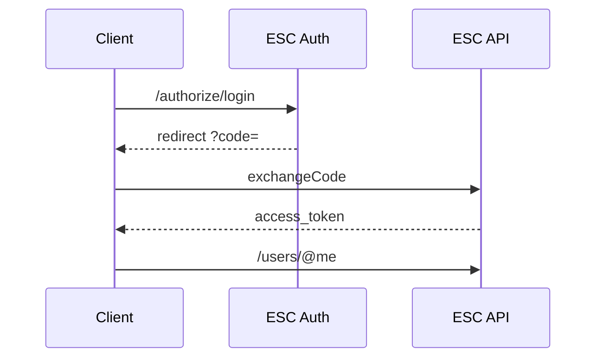

# ESC OAuth SDK

Official **ESC ID** SDK for OAuth 2.0 integration in Node.js applications.

This package abstracts all communication with the ESC authentication API, providing a **simple, secure, and standardized** flow for login, token exchange, refresh, and retrieval of authenticated user data.

---

## 📌 Table of Contents

- [✨ Features](#-features)
- [📦 Installation](#-installation)
- [⚙️ Configuration](#️-configuration)
- [🔐 OAuth Flow](#-oauth-flow)
- [🧩 SDK API](#-sdk-api)
- [🧪 Full Example](#-full-example-test-server)
- [🛡️ Error Handling](#️-error-handling)
- [🧠 Best Practices](#-best-practices)
- [📄 License](#-license)
- [🔗 Links](#-links)

---

## ✨ Features

| Feature | Description |
|------|-----------|
| OAuth2 Authorization Code | Full OAuth 2.0 Authorization Code flow |
| Authorization URL | Automatic login URL generation |
| Token Exchange | Exchange `code` for `access_token` |
| Refresh Token | Secure token renewal |
| Internal Cache | Automatic `/@me` caching |
| Client-side Rate Limit | Protection against abuse |
| Telemetry | Error event emission |
| Error Parser | Standardized API errors |

---

## 📦 Installation

```bash
npm install @esc/oauth-client
````

---

## ⚙️ Configuration

### Creating the Client

```js
const { EscOAuthClient } = require("@esc/oauth-client");

const esc = new EscOAuthClient({
  clientId: "YOUR_CLIENT_ID",
  clientSecret: "YOUR_CLIENT_SECRET",
  redirectUri: "YOUR_CALLBACK"
});
```

---

## 🔐 OAuth Flow



---

## 🧩 SDK API

### `getAuthorizationUrl(scopes[])`

Generates the OAuth authorization URL.

```js
esc.getAuthorizationUrl(["identify", "email"]);
```

| Parameter | Type       | Description         |
| --------- | ---------- | ------------------- |
| scopes    | `string[]` | List of permissions |

🔹 The array is automatically converted to:

```
identify email
```

---

### `exchangeCode(code)`

Exchanges the OAuth `code` for tokens.

```js
const token = await esc.exchangeCode(code);
```

| Returns         |
| --------------- |
| `access_token`  |
| `refresh_token` |
| `expires_in`    |

---

### `getMe(accessToken)`

Fetches authenticated user data.

```js
const me = await esc.getMe(accessToken);
```

| Field    | Description  |
| -------- | ------------ |
| id       | User ID      |
| username | ESC username |

---

### `refreshToken(refreshToken)`

Renews the access token.

```js
const newToken = await esc.refreshToken(refreshToken);
```

---

## 🧪 Full Example (Test Server)

```js
const express = require("express");
const { EscOAuthClient } = require("@esc/oauth-client");

const app = express();

const esc = new EscOAuthClient({
  clientId: "YOUR_CLIENT_ID",
  clientSecret: "YOUR_CLIENT_SECRET",
  redirectUri: "http://localhost:4000/callback"
});

app.get("/login", (req, res) => {
  const url = esc.getAuthorizationUrl(["identify"]);

  res.send(`<a href="${url}">Login with ESC</a>`);
});

app.get("/callback", async (req, res) => {
  const { code } = req.query;

  try {
    const token = await esc.exchangeCode(code);
    const me = await esc.getMe(token.access_token);

    res.json({
      id: me.id,
      username: me.username
    });
  } catch (err) {
    res.status(err.status || 500).json(err);
  }
});

app.listen(4000, () =>
  console.log("🚀 Test server running at http://localhost:4000/login")
);
```

---

## 🛡️ Error Handling

### Standard Format

```json
{
  "error": true,
  "code": "ESC_OAUTH_ERROR",
  "message": "Clear error description"
}
```

### Error Types

| Type        | Source       |
| ----------- | ------------ |
| HTTP Error  | ESC API      |
| OAuth Error | Invalid code |
| Rate Limit  | Client-side  |
| Network     | Axios        |

---

## 🧠 Best Practices

* Never expose `client_secret` on the frontend
* Always validate the received `code`
* Use HTTPS in production
* Store tokens securely

---

## 📄 License

Apache License 2.0

| Permission     | Status |
| -------------- | ------ |
| Commercial use | ✅      |
| Modification   | ✅      |
| Redistribution | ✅      |
| Private use    | ✅      |

---

## 🔗 Links

* 🌐 Website: [https://esc-software.com](https://esc-software.com)
* 📸 Instagram: [https://instagram.com/esc_software](https://instagram.com/esc_software)
* 🧑‍💻 Developers: [https://esc-software.com/developers](https://esc-software.com/developers)

---

<p align="center">
  Created by <a href="https://esc-software.com/">ESC</a>
</p>
